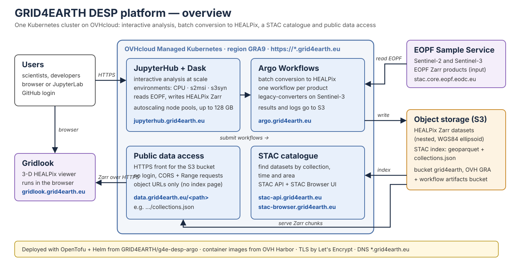
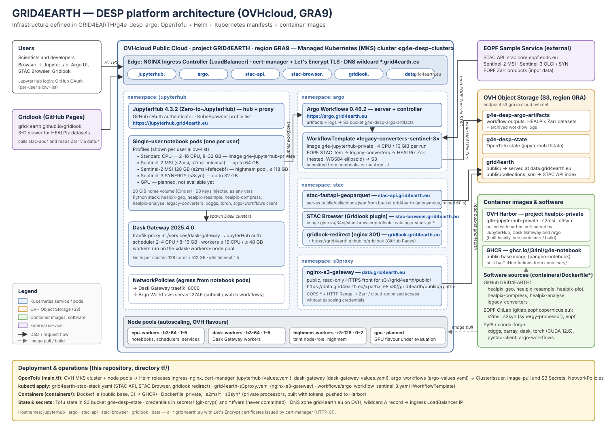

# g4e-desp-argo — GRID4EARTH DESP platform on OVHcloud

Infrastructure-as-code for the GRID4EARTH Destination Earth Service Platform
(DESP) prototype: an interactive and batch processing platform that converts
Copernicus Sentinel products to the HEALPix Discrete Global Grid System (DGGS)
and serves the results as cloud-native Zarr through STAC.

Everything runs on a single OVHcloud Managed Kubernetes cluster (region GRA9) and
is deployed from this repository with OpenTofu, Helm and plain Kubernetes
manifests. The step-by-step deployment procedure is in [`tf/README.md`](tf/README.md).

## Architecture



The overview above ([`docs/architecture-overview.svg`](docs/architecture-overview.svg)) is
meant for presentations. The detailed view below ([`docs/architecture.svg`](docs/architecture.svg))
names every component, namespace, node pool, bucket and registry.



### Components

| Layer | Component | Public URL | Defined in |
|---|---|---|---|
| Interactive computing | JupyterHub 4.3.2 (Zero-to-JupyterHub), GitHub OAuth, per-user profiles | https://jupyterhub.grid4earth.eu | `tf/main.tf`, `tf/values.yaml` |
| Distributed computing | Dask Gateway 2025.4.0, clusters started from notebooks | (via JupyterHub) | `tf/main.tf`, `tf/dask-gateway-values.yaml` |
| Batch processing | Argo Workflows 0.46.2, artifacts in S3 | https://argo.grid4earth.eu | `tf/main.tf`, `tf/argo-values.yaml`, `tf/workflows/` |
| Catalogue | stac-fastapi-geoparquet (STAC API) | https://stac-api.grid4earth.eu | `tf/grid4earth-stac-stack.yaml` |
| Catalogue UI | STAC Browser with Gridlook plugin | https://stac-browser.grid4earth.eu | `tf/grid4earth-stac-stack.yaml` |
| Visualisation | Gridlook (hosted on GitHub Pages, redirect from the cluster) | https://gridlook.grid4earth.eu | `tf/grid4earth-stac-stack.yaml` |
| Data access | nginx-s3-gateway, public read-only front for `s3://grid4earth/public/` (object URLs only, the root and prefixes return 404) | https://data.grid4earth.eu/collections.json | `tf/grid4earth-s3proxy.yaml` |
| Edge | NGINX Ingress Controller, cert-manager + Let's Encrypt, wildcard DNS `*.grid4earth.eu` | — | `tf/main.tf` |
| Compute | OVH MKS node pools: `cpu-workers` (b3-64, 1–5), `dask-workers` (b3-64, 1–5), `highmem-workers` (r3-128, 0–2), GPU planned | — | `tf/main.tf` |
| Storage | OVH Object Storage (S3, GRA): `grid4earth` (public data), `g4e-desp-argo-artifacts` (workflow outputs), `g4e-desp-state` (Tofu state) | — | `tf/main.tf`, `tf/argo-values.yaml` |
| Images | OVH Harbor `healpix-private` (`g4e-jupyterhub-private`, `s2msi`, `s3syn`), GHCR `g4e-notebook` (public base) | — | `containers/` |

### How the pieces fit together

1. **Users** log in to JupyterHub with GitHub. The profile list offers a standard
   CPU environment and, for allowed users, the Sentinel-2 MSI (`s2msi`) and
   Sentinel-3 SYNERGY (`s3syn`) processor environments, plus a 128 GB high-memory
   variant on the tainted `highmem-workers` pool.
2. **Notebooks** can start Dask clusters through Dask Gateway (workers on the
   `dask-workers` pool) and submit Argo workflows with the `argo-workflows` client.
   Both paths are allowed explicitly by NetworkPolicies.
3. **Argo workflows** run the conversion to HEALPix in batch. The
   `legacy-converters-sentinel-3` WorkflowTemplate reads an EOPF Zarr product from
   the EOPF Sample Service STAC, converts it with `legacy-converters` (HEALPix
   nested, WGS84 ellipsoid) and writes the result to the `g4e-desp-argo-artifacts`
   bucket.
4. **Published datasets** live under `s3://grid4earth/public/` (`converted/`,
   `eopf-mirror/`, `auxiliary/`, see the bucket layout in
   [project-guidelines](https://github.com/GRID4EARTH/project-guidelines)). The
   per-collection notebooks in
   [legacy-datasets](https://github.com/GRID4EARTH/legacy-datasets) run
   `legacy-converters` on the platform and write there.
   [stac-scraper](https://github.com/GRID4EARTH/stac-scraper) then scans the
   bucket, extracts the STAC item embedded in each EOPF Zarr store and writes
   per-collection stac-geoparquet files plus `public/collections.json`. The STAC
   API reads that index anonymously, STAC Browser and Gridlook query the API, and
   the Zarr chunks are fetched over HTTPS from `data.grid4earth.eu` (CORS and
   Range requests enabled, no credentials).
5. **Container images** for notebooks, Dask and Argo are the same
   `g4e-jupyterhub-private` image, built from `containers/` and pushed to the
   private Harbor registry. It bundles the GRID4EARTH packages (`healpix-geo`,
   `healpix-resample`, `healpix-plot`, `healpix-compress`, `healpix-analyse`,
   `legacy-converters`) on top of a public `g4e-notebook` base built by CI.

## Repository layout

```
.
├── containers/           Dockerfiles for the notebook / processor images
│   ├── Dockerfile          public base image (pangeo-notebook + GRID4EARTH open-source packages)
│   ├── Dockerfile_private* private image with healpix-compress, healpix-analyse, legacy-converters
│   ├── Dockerfile_s2msi*   Sentinel-2 MSI processor environments (EOPF GitLab)
│   ├── Dockerfile_s3syn*   Sentinel-3 SYNERGY processor environments (EOPF GitLab)
│   └── .build              commands used to build and push the images to Harbor
├── tf/                   OpenTofu + Kubernetes deployment
│   ├── main.tf             MKS cluster, node pools, Helm releases, secrets, network policies
│   ├── values.yaml         JupyterHub configuration (profiles, Dask Gateway wiring)
│   ├── dask-gateway-values.yaml, argo-values.yaml
│   ├── grid4earth-stac-stack.yaml   STAC API, STAC Browser, gridlook redirect
│   ├── grid4earth-s3proxy.yaml      nginx-s3-gateway (data.grid4earth.eu)
│   ├── workflows/          Argo WorkflowTemplates
│   └── README.md           deployment procedure, credentials, operations notes
├── docs/architecture.svg Architecture diagram
└── .github/workflows/    CI building the public base image to GHCR
```

## Deploying and operating

See [`tf/README.md`](tf/README.md): prerequisites (OpenTofu, kubectl, helm, OVH API
and S3 credentials), the four-pass `tofu apply`, DNS, Harbor, JupyterHub profiles,
the S3 proxy and the STAC stack. Secrets are kept in `secrets/` (git-crypt) and in
`*.tfvars` files that are never committed.

## Related GRID4EARTH repositories

- [healpix-geo](https://github.com/GRID4EARTH/healpix-geo), [healpix-resample](https://github.com/GRID4EARTH/healpix-resample), [healpix-plot](https://github.com/GRID4EARTH/healpix-plot), [healpix-compress](https://github.com/GRID4EARTH/healpix-compress), [healpix-analyse](https://github.com/GRID4EARTH/healpix-analyse) — HEALPix DGGS libraries installed in the images
- [legacy-converters](https://github.com/GRID4EARTH/legacy-converters) — conversion of Sentinel products to HEALPix, used by the Argo workflows
- [legacy-datasets](https://github.com/GRID4EARTH/legacy-datasets) — per-collection pipeline notebooks that produce the published HEALPix datasets
- [stac-scraper](https://github.com/GRID4EARTH/stac-scraper) — builds the STAC index (`stac-geoparquet` + `collections.json`) served by the STAC API
- [stac-browser](https://github.com/GRID4EARTH/stac-browser) (branch `gridlook-asset-action`, image `ghcr.io/j34ni/stac-browser:gridlook`) — the STAC Browser deployed here, with an "open in Gridlook" asset action
- [gridlook](https://github.com/GRID4EARTH/gridlook) — 3-D viewer published on GitHub Pages, reached through `gridlook.grid4earth.eu`
- [project-guidelines](https://github.com/GRID4EARTH/project-guidelines) — bucket layout, pipelines and user how-tos

## Licence

MIT, see [LICENSE](LICENSE).
